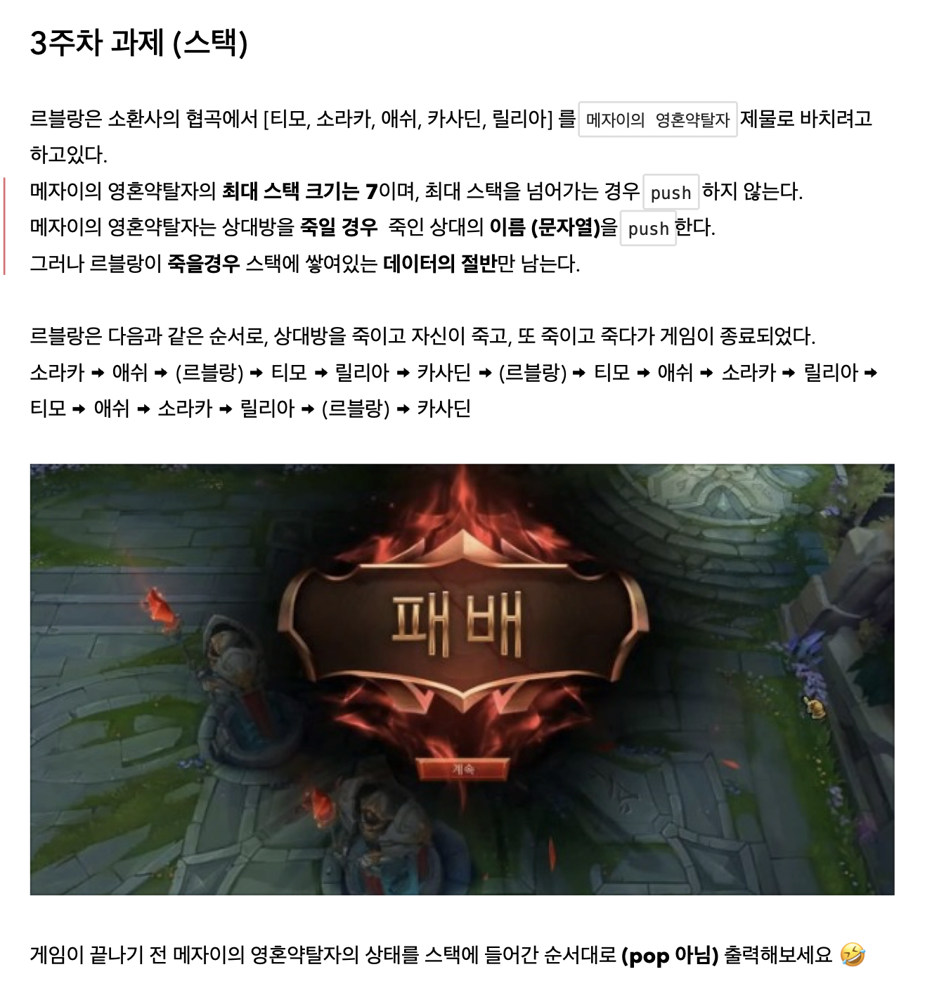
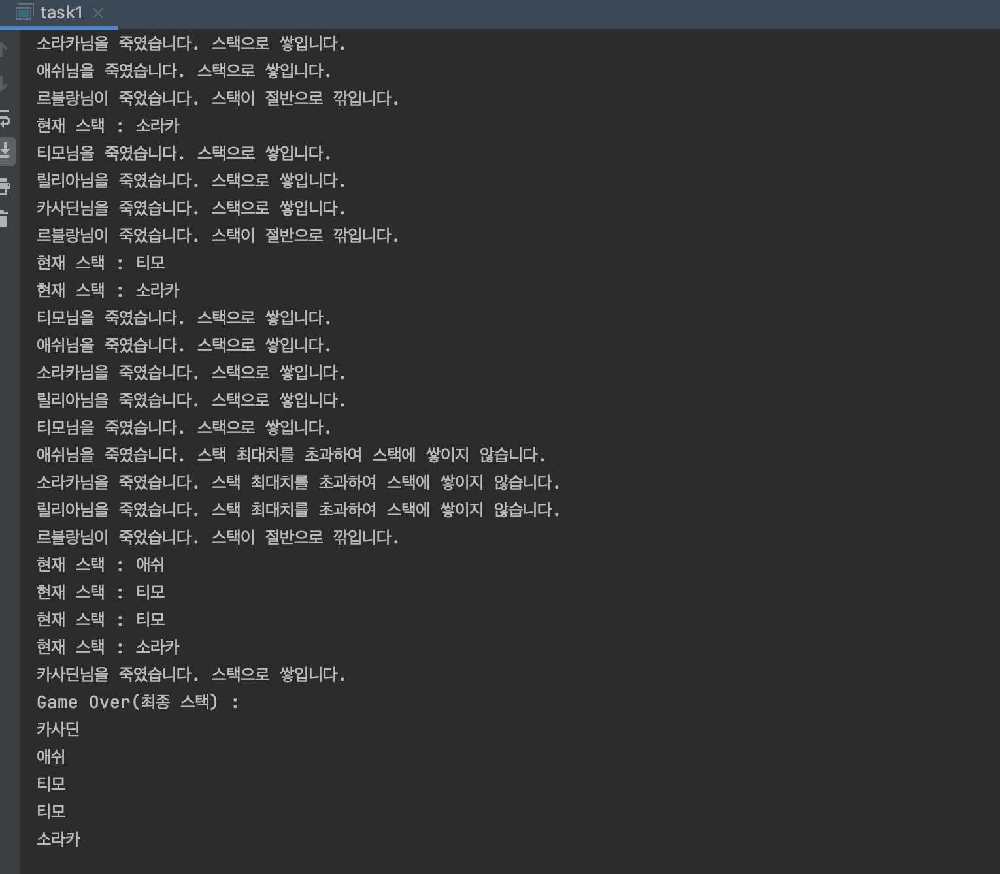

# 3주차 과제



## 🔍작성코드 설명

스택에 배열을 넣기 위해 typedef를 이용하여 char*를 element로 지정하여 사용
자료가 쌓이는 stack과 데이터 및 함수의 반환 형식을 element로 지정하여 문자열이 저장되고 출력될 수 있도록 하였다.
죽었을 때 스택의 데이터가 절반이 사라지는 구현을 위해 death라는 함수를 생성했다.


### 📌어려웠던 점

스택에 문자형을 저장하고 출력하는 구현 & 스택의 절반의 데이터가 사라지는 구현

- 스택에 문자형을 저장하는 구현은 우선 `stack` 과 저장하는 데이터 그리고 출력하는 데이터의 자료형이 그냥 `char` 형이 아닌(`char` 은 문자 1자리만 저장!) `char*` 으로 선언함으로써 문자열을 저장하고 출력할 수 있도록 함으로써 해결했다.
- 여기서 `stack` 과 데이터 및 함수의 반환 형식이 전부 `char*` 이어야지만 정상적으로 출력되고 그렇지 않으면 에러는 발생하지 않지만 출력 자체가 되지 않는다. (아마 스택에 저장자체를 못하는 것 같다.)

```c
## 죽었을 때 메자이 스택이 절반으로 깎이는 함수
void death(){
    for(int i = 0; i <= (top+1)/2; i++) pop();
    printf("르블랑님이 죽었습니다. 스택이 절반으로 깎입니다.\n");
    for(int i=0; i<= top; i++) printf("현재 스택 : %s\n", stack[top-i]);
}
```

- 위 함수에서 for문 안에 `i <= (top+1)/2;` 이 부분이 `i < (top+1)/2;` 가 되어야 한다고 생각했지만 그렇게 했을 경우 원래 사라져야할 데이터에서 하나가 덜 사라지는 현상이 있다. 이는 아직도 왜 그렇게 되는 것인지는 이해가 되지 않는다.

## 🖥실행 결과

챔피언을 처치했을 때 `push` 하면서 스택에 저장하고 (이때 스택의 최대값인 7을 넘어가면 `push` 하지않고 스택에 쌓이지 않는다고 출력함) `printf` 를 통해 아래와 같이 출력되도록 하였고, 본인 챔피언이 죽었을 때는 `death` 함수를 통해 스택의 데이터 절반을 지우고 현재 스택을 출력하도록 구현하였다. 
마지막으로 게임 종료 시 Game Over와 동시에 현재 쌓인 스택의 데이터를 출력하도록 하였다.


